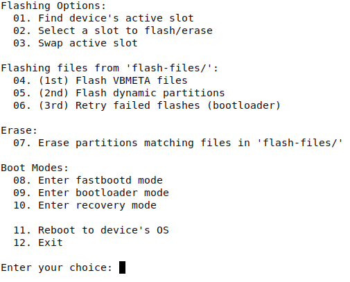

# Android Image Flasher

A bash script for flashing Android image files to your device, built around the A/B partition scheme.

## Table of Contents

- [Features](#features)
- [Screenshot](#screenshot)
- [Requirements](#requirements)
- [Getting Started](#getting-started)
- [How It Works](#how-it-works)
- [Flashing Workflow](#flashing-workflow)
  - [Selecting a Slot](#selecting-a-slot)
- [Menu Reference](#menu-reference)
- [F.A.Q.](#faq)
  - [Where do I add files to flash to my device?](#where-do-i-add-files-to-flash-to-my-device)
  - [How does the script know the partition name to flash each file to?](#how-does-the-script-know-the-partition-name-to-flash-each-file-to)
  - [Does this script ONLY work with A/B partition schemes?](#does-this-script-only-work-with-ab-partition-schemes)
  - [Why does it refuse to run an action and mention devices?](#why-does-it-refuse-to-run-an-action-and-mention-devices)
  - [The script says my device is 'unauthorized'](#the-script-says-my-device-is-unauthorized)
  - [Flashing keeps failing because a partition is not found or needs to be resized](#flashing-keeps-failing-because-a-partition-is-not-found-or-needs-to-be-resized)
- [Download](#download)

## Features

- Flash any combination of Android image files
  - repair your boot partition, apply firmware updates, or add custom recovery
- Select a slot to flash
  - designed for devices with A/B partition schemes, but works on single-slot devices too
- Find a device's active partition slot
  - detects whether your device uses an A/B partition scheme
- Swap the device's active slot
  - choose which slot you want to boot from
- Safety checks before anything runs
  - shows the connected device's model + USB serial and asks for confirmation before destructive actions
  - refuses zero, multiple, or ambiguous (one ADB + one fastboot) device setups
- Protects per-device data partitions (persist, modemst1/2, userdata, etc.) from accidental erasure
  - skipped during erase and called out with a warning if you try to flash them (see `docs/partitions-never-erase.md`)
- Anti-rollback (ARB) detection warns before flashing older firmware over a higher-ARB device (requires `otaripper`)

## Screenshot



## Requirements

1. Linux system (macOS is not supported: GNU coreutils' `timeout` and GNU grep PCRE support are required)
2. ADB and fastboot installed (Android platform-tools)
3. USB Debugging enabled on the device
4. Bootloader unlocked on the device
5. bash 4.4 or newer
6. GNU grep (with PCRE support)
7. util-linux's `flock` (used for the single-instance lock; preinstalled on virtually all distros)
8. (Optional) `otaripper` — enables firmware anti-rollback (ARB) level detection for downgrade warnings

## Getting Started

1. Download the zip file (see [Download](#download) below)
2. Extract it on your Linux box
3. Open a terminal in the extracted folder
4. Run the script:

   ```bash
   bash Android-Image-Flasher.sh
   ```

5. Add the image files you want to flash to the `flash-files/` directory:
   - if `flash-files/` is not present, the script will create it for you
   - files are scanned on startup, so **exit and restart the script** after adding or removing files

## How It Works

- Only files ending in `.img` or `.bin` are used; all others are ignored
- The partition name comes from the filename, minus the extension
  - e.g. `boot.img` flashes to the `boot` partition
- Files starting with `vbmeta` are flashed with the `--disable-verity --disable-verification` flags

## Flashing Workflow

Recommended order of operations from the menu:

> **Device verification:** every device-touching menu option identifies the connected phone once — model plus USB serial — before anything runs. Destructive options (swap slot, flash, erase) ask you to confirm it is the correct device; read-only/reboot options just display what they found. Keep **exactly one** device connected: two visible devices refuse the action, and if the confirmed device disappears mid-operation (or a different serial appears after a reboot into fastboot mode), the action aborts instead of touching the wrong phone — erase paths included. An 'unauthorized' device (pending USB-debugging prompt) is called out with instructions.

1. **(1st) Flash VBMETA files** — flashes all `vbmeta*` files in `flash-files/` (skip this if you have no vbmeta files)
2. **(2nd) Flash dynamic partitions** — flashes all remaining files in `fastbootd` mode, which is required for dynamic/logical partitions
3. **(3rd) Retry failed flashes (bootloader)** — retries any failed flashes in bootloader mode
   - logical (dynamic) partitions can't be flashed from bootloader mode, so the retry skips them and offers to reboot back into fastbootd to flash them under option 5
   - if partitions still fail, a log file called `flash_failures.log` is created in the script's directory

### Selecting a Slot

- Use **Select a slot to flash/erase** to flash a specific slot (`_a` or `_b` suffix)
- Or use **Swap active slot** to reboot into the slot you want to flash
  - if the slot you swapped to is the slot you want to flash, there is no need to also select a slot — the script will flash to the active slot
- On single-slot devices, skip slot selection entirely and the script flashes without a slot suffix

## Menu Reference

| #   | Option                                            | What it does                                                   | Mode used       |
| --- | ------------------------------------------------- | -------------------------------------------------------------- | --------------- |
| 01  | Find device's active slot                         | Detects the active A/B slot                                    | ADB or fastboot |
| 02  | Select a slot to flash/erase                      | Set the slot suffix to `_a`, `_b`, or clear it                 | —               |
| 03  | Swap active slot                                  | Switches the device to the other slot                          | bootloader      |
| 04  | (1st) Flash VBMETA files                          | Flashes `vbmeta*` files with disable-verity flags              | bootloader      |
| 05  | (2nd) Flash dynamic partitions                    | Flashes all other files, tracks failures                       | fastbootd       |
| 06  | (3rd) Retry failed flashes                        | Retries failed flashes (skips fastbootd-only partitions); logs to `flash_failures.log` if needed | bootloader      |
| 07  | Erase partitions matching files in `flash-files/` | Erases the active slot's partitions for each file              | fastbootd       |
| 08  | Enter fastbootd mode                              | Reboots into fastbootd (userspace fastboot)                    | —               |
| 09  | Enter bootloader mode                             | Reboots into the bootloader                                    | —               |
| 10  | Enter recovery mode                               | Reboots into recovery                                          | —               |
| 11  | Reboot to device's OS                             | Boots the device back into Android                             | ADB or fastboot |
| 12  | Exit                                              | Leaves the script                                              | —               |

*This table mirrors the menu printed by the script — keep the two in sync when changing options.*

## F.A.Q.

### Where do I add files to flash to my device?

In the `flash-files/` directory, inside the script's directory. You can add files ending in `.img` and `.bin`; all others will be ignored.

### How does the script know the partition name to flash each file to?

The script takes every file from the `flash-files/` directory, removes the file extension, and uses the remaining filename as the partition name.

### Does this script ONLY work with A/B partition schemes?

No. If you choose not to select a slot to flash to, the script will flash without a slot suffix.

### Why does it refuse to run an action and mention devices?

The script only ever operates on exactly one known phone:

- **More than one device visible** (in ADB or fastboot) — disconnect all but your target
- **One device in ADB and another in fastboot** — ambiguous target; disconnect one
- **Confirmed device disappeared or a different serial appeared** mid-action (e.g. after a reboot into fastboot mode) — reconnect the original device and retry

### The script says my device is 'unauthorized'

Accept the **Allow USB debugging?** prompt on the phone's screen (tick *Always allow from this computer* to avoid repeats), then run the menu option again.

### Flashing keeps failing because a partition is not found or needs to be resized

- If a partition needs to be resized, that can only be done in fastbootd mode
- Instead of selecting a slot, swap to the slot you wish to flash and flash without a slot suffix, allowing the script to flash to the active slot instead

## Download

- [Zip file from GitHub (always up to date)](https://github.com/misterG13/Android-Image-Flasher/archive/refs/heads/main.zip)
